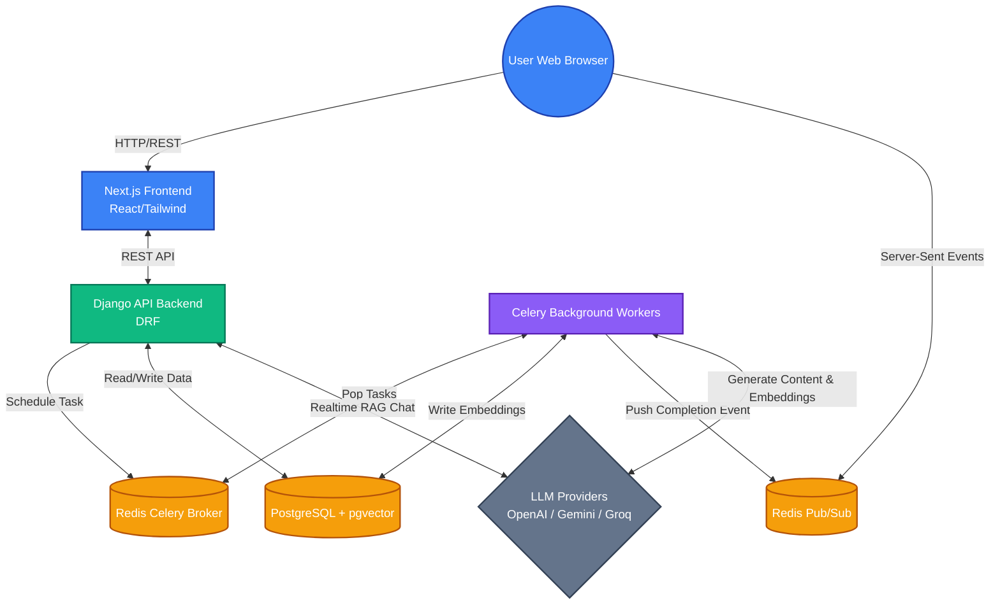
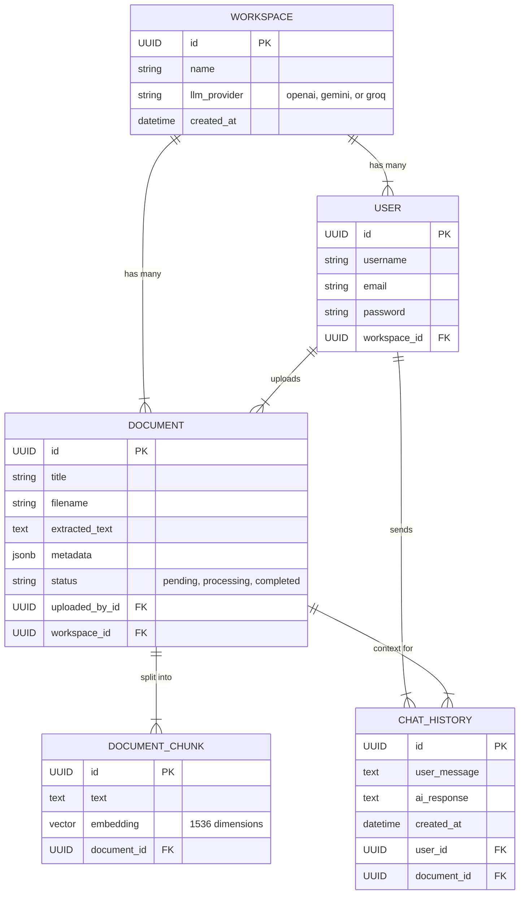

# Cyberify AI Platform

A robust, full-stack Artificial Intelligence platform for Retrieval-Augmented Generation (RAG) and intelligent document processing. The application features multi-LLM routing (OpenAI, Gemini, Groq), a dynamic vector embedding pipeline using PostgreSQL (`pgvector`), real-time Server-Sent Event (SSE) notifications, and a highly polished glassmorphism Next.js UI.

## Setup & Run Instructions

This project is fully containerized using Docker and Docker Compose. You do not need to install local dependencies.

### Prerequisites
- Docker & Docker Compose installed.
- Valid API keys for Google Gemini, OpenAI, or Groq.

### Running Locally

1. **Environment Variables**:
   In the `backend` folder, create a `.env` file containing your credentials:
   ```env
   # backend/.env
   DB_NAME=cyberify
   DB_USER=postgres
   DB_PASSWORD=postgres
   DB_HOST=postgres
   DB_PORT=5432
   CELERY_BROKER_URL=redis://redis:6379/0

   # AI Provider Keys
   OPENAI_API_KEY=sk-...
   GEMINI_API_KEY=AIza...
   GROQ_API_KEY=gsk_...
   ```

2. **Start the Infrastructure**:
   In the root directory, run:
   ```bash
   docker compose up --build -d
   ```
   This will spin up:
   - **Postgres Database** (with pgvector)
   - **Redis Cache/Broker**
   - **Django Backend** (on `http://localhost:8000`)
   - **Celery Worker** (for background processing)
   - **Next.js Frontend** (on `http://localhost:3000`)

3. **Database Migrations**:
   Once the containers are running, execute the migrations inside the backend container:
   ```bash
   docker compose exec backend python manage.py makemigrations
   docker compose exec backend python manage.py migrate
   ```

4. **Access the Application**:
   Open `http://localhost:3000` in your web browser. 

---

## API Documentation (Swagger)

The project includes automatically generated OpenAPI (Swagger) documentation via `drf-spectacular`.

With the backend running, visit:
- **Swagger UI**: [http://localhost:8000/api/docs/](http://localhost:8000/api/docs/)
- **OpenAPI Schema**: [http://localhost:8000/api/schema/](http://localhost:8000/api/schema/)

---

## Architecture Diagram

The system uses a decoupled microservices-like architecture:



---

## Entity Relationship Diagram (ERD)

The database models isolate users by Workspaces, ensuring a secure multitenant SaaS environment.



---

## Deployment Recommendations

The project is configured for deployment using standard Docker tools. 

- **Frontend (Next.js)**: Easily deployed on **Vercel** or Netlify by linking your GitHub repository and setting the build command to `npm run build` and output directory to `.next`.
- **Backend (Django/Celery)**: Easily deployed on **Render**, **Railway**, or **DigitalOcean App Platform** using the `Dockerfile` present in the backend directory.
- **Database**: A managed PostgreSQL database (such as **Supabase** or Render Managed Postgres) with the `pgvector` extension enabled is required.
